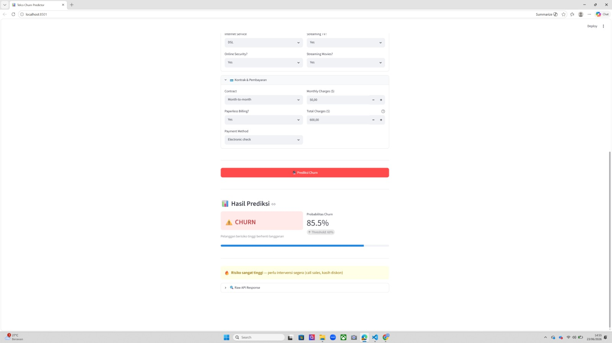
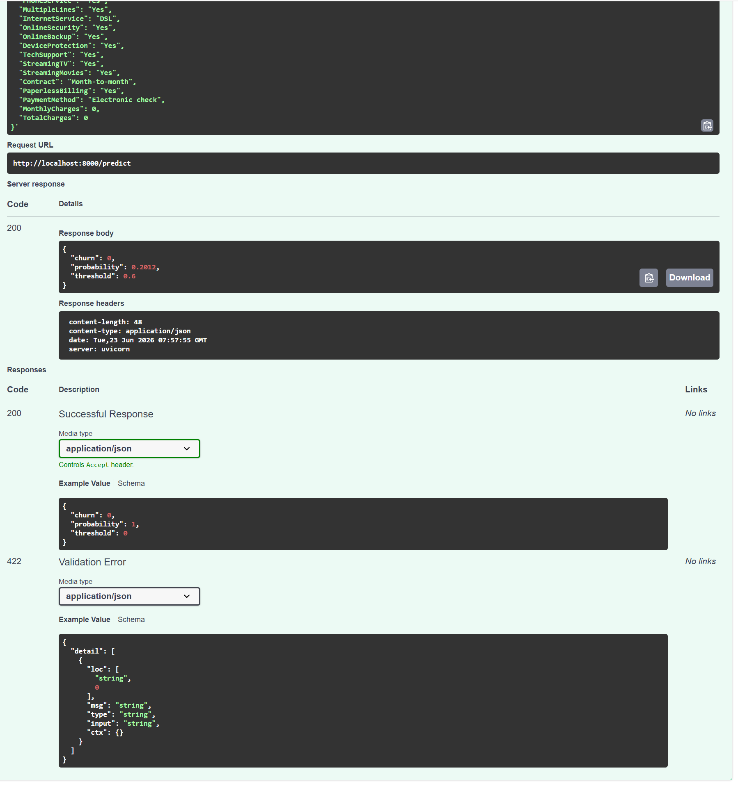

# 📊 Telco Customer Churn Prediction

> End-to-end Machine Learning project — dari EDA sampai deployment-ready API — untuk memprediksi pelanggan telekomunikasi yang berisiko *churn* (berhenti berlangganan).


## 🖼️ Demo

| Streamlit UI | API Docs (Swagger) |
|---|---|
|  |  |


---

## 🎯 Problem Statement

Sebuah perusahaan Telco kehilangan **26.5%** pelanggannya (1.869 dari 7.043). Dengan asumsi ARPU Rp 500rb/bulan, churn ini setara potensi kehilangan **~Rp 934 juta/bulan**.

Tujuan project: **memprediksi pelanggan yang akan churn** sebelum mereka pergi, sehingga tim retensi bisa melakukan intervensi terarah (promo, follow-up) — bukan menebak.

Tantangan utama: dataset **imbalanced** (hanya 26.5% positif), sehingga *accuracy* menyesatkan. Fokus metrik ada di **Recall** & **F1** — menangkap sebanyak mungkin calon churner.

---

## 📈 Key Results

Tiga model dibandingkan pada test set (threshold default 0.5):

| Model | Recall | F1 | ROC-AUC | Accuracy |
|---|---|---|---|---|
| **Logistic Regression** ✅ | 0.791 | 0.612 | **0.842** | 0.733 |
| Random Forest | 0.757 | **0.634** | 0.842 | 0.768 |
| XGBoost | 0.668 | 0.597 | 0.818 | 0.761 |

**Model final: Logistic Regression** — dipilih karena **recall & ROC-AUC tertinggi**, *interpretable*, dan murah di-deploy (meski F1 Random Forest sedikit lebih tinggi).

Setelah **threshold tuning ke 0.60** (memaksimalkan F1):

| Metric | Score |
|---|---|
| Precision | 0.561 |
| Recall | 0.717 |
| F1 | **0.629** |
| ROC-AUC | 0.842 |

💰 **Estimasi business impact:** ~**Rp 203 juta/tahun** net profit dari retensi terarah (asumsi ARPU Rp 500rb, biaya promo Rp 50rb, retention rate 60%).

---

## 🏗️ Architecture

```
┌─────────────┐     ┌────────────────────────┐     ┌──────────────────┐
│  Raw Data   │────▶│  Preprocessing          │────▶│  Model Training  │
│ (IBM Telco) │     │  src/preprocessing.py   │     │  notebooks/  +   │
└─────────────┘     └────────────────────────┘     │  MLflow tracking │
                                                     └────────┬─────────┘
                                                              │ artifacts
                                                              ▼
                            ┌──────────────────────────────────────────┐
                            │ models/  (preprocessor · model · config)  │
                            └────────────────┬─────────────────────────┘
                                             │
                        ┌────────────────────┴────────────────────┐
                        ▼                                          ▼
                ┌────────────────┐                       ┌──────────────────┐
                │   FastAPI      │◀──────HTTP / JSON──────│   Streamlit UI   │
                │   app/main.py  │                        │ streamlit_app.py │
                │   POST /predict│                        └──────────────────┘
                └────────────────┘
```

Logika preprocessing (`src/preprocessing.py`) dipakai **identik** di training maupun di API — tidak ada duplikasi yang bisa drift.

---

## 🛠️ Tech Stack

| Kategori | Tools |
|---|---|
| **ML & Data** | scikit-learn, pandas, XGBoost |
| **Experiment Tracking** | MLflow (SQLite backend) |
| **Hyperparameter Tuning** | Optuna (TPE) |
| **API Serving** | FastAPI + Uvicorn + Pydantic |
| **Frontend** | Streamlit |
| **EDA / Viz** | matplotlib, seaborn |

---

## 🚀 Quick Start

```bash
# 1. Clone & setup environment
git clone <repo-url>
cd telco-churn-prediction
python -m venv .venv
.venv\Scripts\activate          # Windows  (macOS/Linux: source .venv/bin/activate)

# 2. Install dependencies
pip install -r requirements.txt         # production (API + Streamlit)
# pip install -r requirements-dev.txt   # + training/EDA/notebooks

# 3. Jalankan API
uvicorn app.main:app --reload           # -> http://127.0.0.1:8000/docs

# 4. Jalankan Streamlit (terminal terpisah)
streamlit run streamlit_app.py          # -> http://localhost:8501

# 5. (opsional) Lihat eksperimen di MLflow
mlflow ui --backend-store-uri sqlite:///mlflow.db   # -> http://localhost:5000
```

> Dataset (`data/raw/Telco-Customer-Churn.csv`) tidak ikut repo. Unduh dari [Kaggle — IBM Telco Customer Churn](https://www.kaggle.com/datasets/blastchar/telco-customer-churn) dan letakkan di `data/raw/` jika ingin menjalankan ulang notebook.

---

## 📁 Project Structure

```
telco-churn-prediction/
├── app/                      # FastAPI service
│   ├── main.py               #   endpoints: GET / , POST /predict
│   └── schemas.py            #   Pydantic request/response models
├── src/
│   └── preprocessing.py      # reusable cleaning + feature engineering
├── notebooks/
│   ├── 01_EDA.ipynb          # exploratory data analysis
│   ├── 02_preprocessing.ipynb# pipeline + MLflow intro
│   └── 03_Modelling.ipynb    # modeling, tuning, threshold, business impact
├── models/                   # trained artifacts (committed)
│   ├── model_final.joblib
│   ├── preprocessor.joblib
│   └── model_config.json
├── scripts/
│   └── smoke_test.py         # demo preprocessing + MLflow experiment
├── figures/                  # EDA & evaluation plots
├── docs/
│   ├── MODEL_CARD.md         # model card (HF style)
│   ├── API_USAGE.md          # request/response examples
│   └── screenshots/          # demo images
├── data/raw/                 # dataset (not committed)
├── streamlit_app.py
├── requirements.txt          # production deps
├── requirements-dev.txt      # + training/EDA deps
└── README.md
```

---

## 🔬 ML Pipeline

1. **EDA** ([01_EDA.ipynb](notebooks/01_EDA.ipynb)) — distribusi, churn rate per fitur, korelasi.
2. **Preprocessing** ([02_preprocessing.ipynb](notebooks/02_preprocessing.ipynb)) — cleaning `TotalCharges`, 4 engineered features (`num_addons`, `is_new_customer`, `has_internet`, `tenure_group`), `ColumnTransformer` (scale + one-hot) → 52 fitur.
3. **Modeling** ([03_Modelling.ipynb](notebooks/03_Modelling.ipynb)) — 3 baseline model, Optuna tuning, **threshold tuning (0.60)**, business impact, semua di-track di MLflow.

Detail lengkap model → [docs/MODEL_CARD.md](docs/MODEL_CARD.md). Cara pakai API → [docs/API_USAGE.md](docs/API_USAGE.md).

---

## 🔮 Future Work

- [ ] Containerize dengan **Docker** (API + Streamlit)
- [ ] Deploy ke cloud (Railway / Render / GCP)
- [ ] **CI/CD** via GitHub Actions (test + auto-deploy)
- [ ] Model monitoring & drift detection

---

## 👤 Author

**[Muhammad Abil Khoiri]** — Data Science / ML Engineering portfolio project

- GitHub: [@MonyetttRindam](https://github.com/MonyetttRindam)
- LinkedIn: [Muhammad Abil Khoiri](https://www.linkedin.com/in/muhammadabilkhoirii/)

---

## 📄 License

MIT License — lihat [LICENSE](LICENSE).
